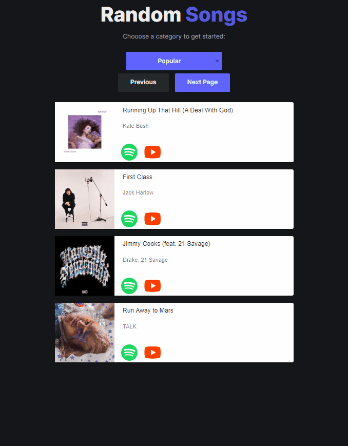

# Random Songs

Utilizes Spotify and DuckDuckGo APIs to display previews and music videos of popular songs in random order.

This app uses React for the frontend, and python scripts for data collection

    Live demo: https://jweilhammer.github.io/random-songs:

    

# APIs
The [Spotify API](https://developer.spotify.com/documentation/web-api/) is used to get the main song data (name, artist, picture, etc...):

The [DuckDuckGo API](https://duckduckgo.com/api) is used to get youtube links for these same songs to embed music videos.  Currently this is ued client-side and caches the results, I'd like to get these links pre-compiled to serv statically with the rest of the data, but that is more work (see [youtube.py](scripts/youtube.py)):

# Scripts
There is a [main spotify data collection script](scripts/main.py) that is run daily on Github actions and commits the latest song data to the repo on the `gh-pages` branch .  Songs are served as a static json that is hosted on github pages and includes 500 songs per category which are shuffled client-side.

The script uses the spotify API to retrieve popular categories and get songs for each.  Custom categories are also defined (decades: 70s, 80s, 90s, etc..)

To keep the songs of a decent quality, the script filters the total songs for each category down to the top 500 most popular.  500 in each category seems like enough to keep things fresh.

# Deployment

This app is deployed on Github Pages statically, with Github Actions scripts that update the content daily. The site is functions as a PWA that uses Workbox service workers to cache content client-side

Currently the builds are done locally so the song data can be updated independently, and so Github Actions doesn't have to re-install and build everytime.

The `gh-pages` branch is what is actively deployed and should be kept up to date with `main`

See:
- [.github/workflows/pages.yaml](.github/workflows/pages.yaml)
- [.github/workflows/spotify_data.yaml](.github/workflows/spotify_data.yaml)
- [frontend/build/](frontend/build/)

### TODO
Cleanup and/or rewrite project without the react template, it includes lots of fluff scsss that I'm not even using anymore.  Made things easier to start with, but harder to maintain.  Also includes lots of vulnerabilities through the frontend dependencies that I'm not concerned with right now